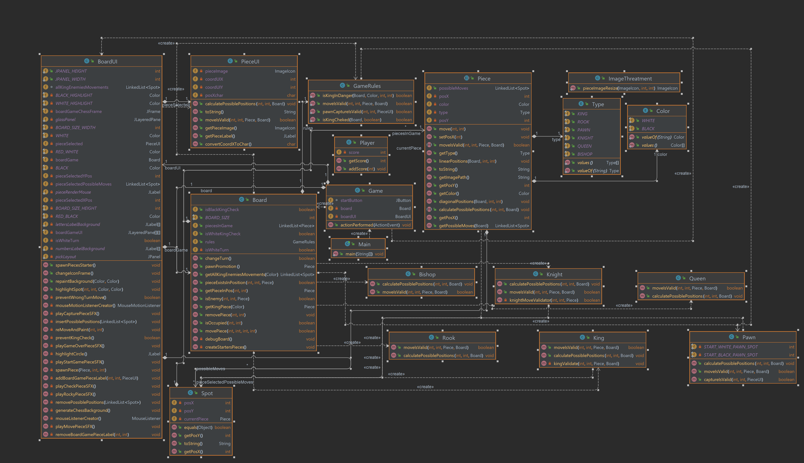

# JavaChess

Feito por:
- [Augusto Vinicius](https://github.com/AugustoViniciusCarvalho)
- [Daniel Luan](https://github.com/DanieLuan)
- [Murilo da Rocha](https://github.com/th3-Rocha)

# O que é o JavaChess?
JavaChess é um projeto feito para a disciplina de Linguagem de Programação II, no período de 2022.2.
O projeto consiste em implementar um jogo de xadrez em Java, utilizando a biblioteca Swing para a interface gráfica.
Para isso, foram criados diversos pacotes e classes, que serão explicados a seguir.

# O projeto

O projeto do JavaChess é dividido em 5 pacotes principais:
 - Pieces: Contém as classes das peças do jogo, seus métodos e funções de validação de movimento.
 - Board: Contém as classes que representam o tabuleiro e tem todas informações de onde estão as peças.
 - Game: Contém as classes que representam o jogo, como o turno, o jogador, o estado do jogo, etc.
 - Ui: Contém as classes que representam a interface do jogo, como o menu, o tabuleiro, etc.
 - Util: Conjunto de classes utilitárias para o projeto.

### Pieces

Pacote que contém a classe abstrata Piece e (quase) todos os seus filhos (falaremos do PieceUI mais a frente).
A classe Piece é responsável por agrupar todos os métodos que são comuns às peças, e trazer flexibilidade
quando for necessário criar uma peça específica.

### Board

O pacote Board é responsável por gerenciar todo o tabuleiro por trás das cenas. Ele possui uma lista ligada de Pieces,
e essa é a base para o funcionamento do xadrez. Além disso, possui também uma classe Spot que facilita o trabalho na busca
por peças em determinadas posições e vice versa.

### UI

Este pacote gere toda a geração e funcionamento da interface gráfica do xadrez. Foi utilizado Java Swing para tal.
O board UI é a classe mais importante do programa, pois ele conversa tanto com o usuário, quanto com o board que trabalha
gerenciando o jogo. Basicamente, a UI depende do board em um momento, e o board depende da UI em outro.

### Util

Conjunto de classes e enum's que são utilizados para facilitar o trabalho com o xadrez. Como o enum Color, ou o Type, que
facilita na hora de criar uma peça e comparar com outras.

### Game

Último pacote feito, porém ainda está incompleto e por isso não será muito citado aqui. Basicamente ele deveria gerenciar
as regras mais avançadas do xadrez e ser um intermediário entre a UI e o board. Porém, por falta de tempo, não foi possível
realizar essa implementação, por este motivo o BoardUI acabou ficando muito maior.

# Diagrama de classes



# Como realizar build

O projeto foi estruturado utilizando Maven e Java 17, então para realizar a build do projeto, basta ter o maven instalado em sua IDE 
e criar a Build seguindo a sua IDE.

# Como executar

O projeto foi unificado em um arquivo .jar para facilitar a execução. Para fazer isso, basta acessar as
pastas abaixo:

```
cd out\artifacts\chessAI_jar
```
Apos isso, basta executar o comando abaixo:
```
java -jar chessAI.jar
```


